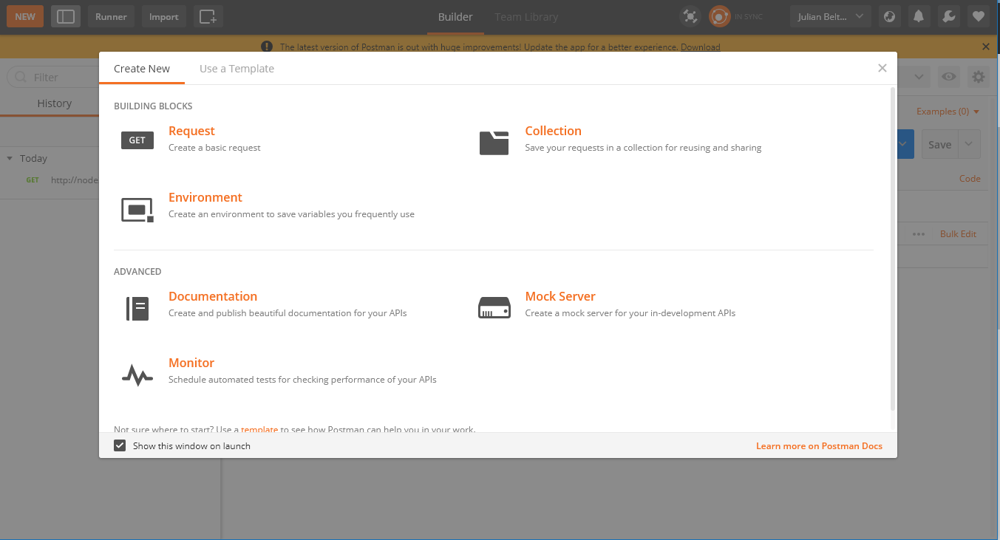
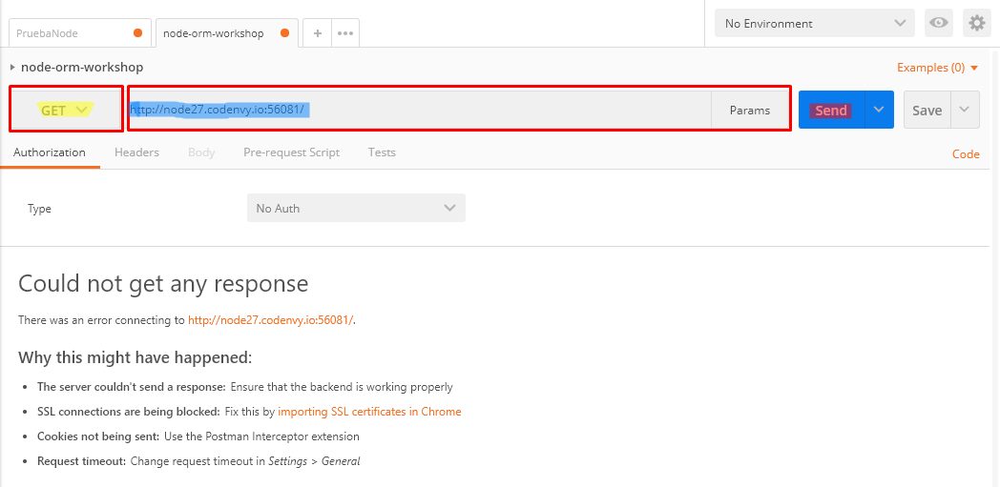
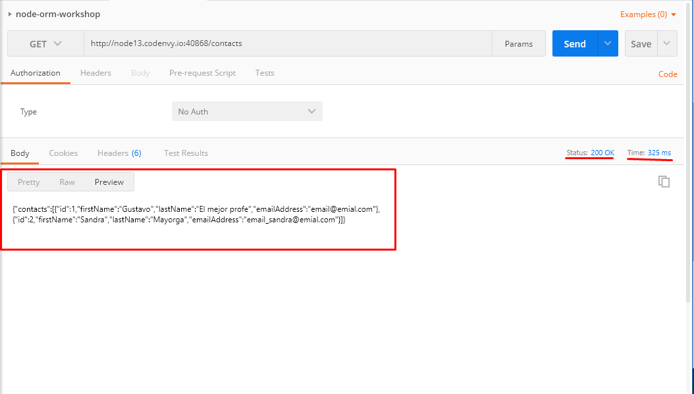
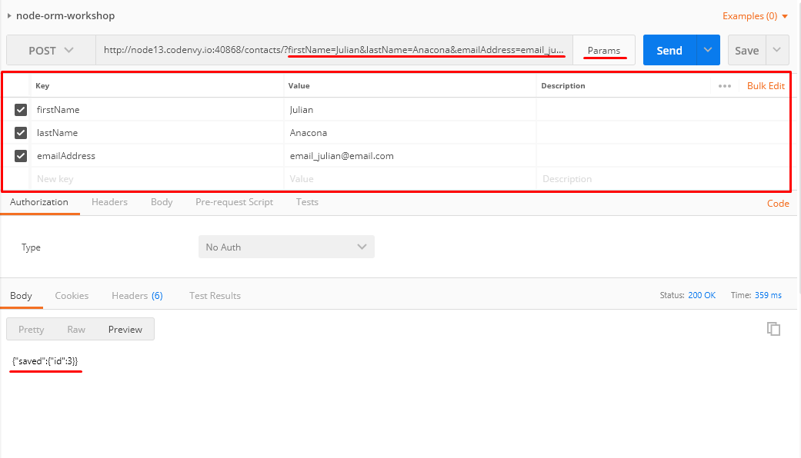
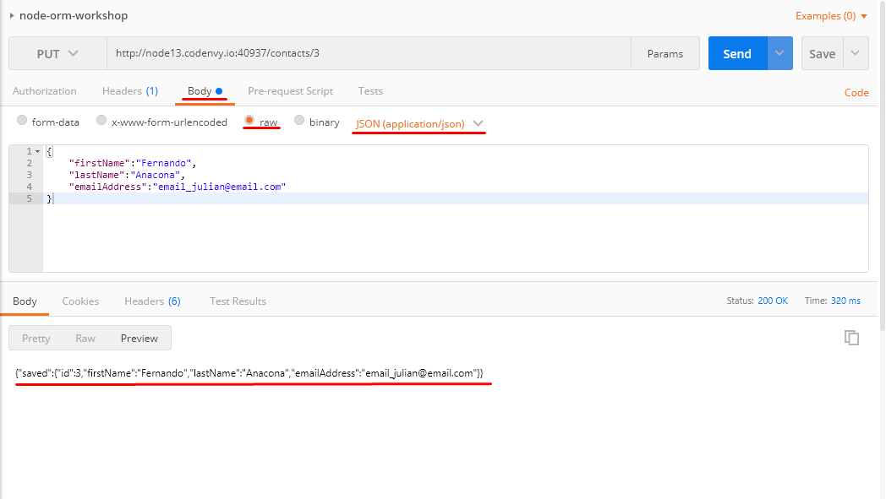
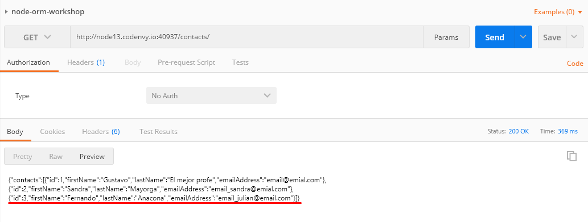
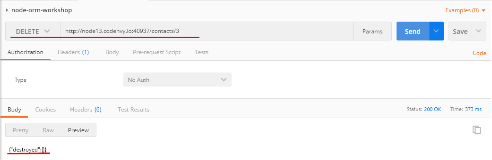
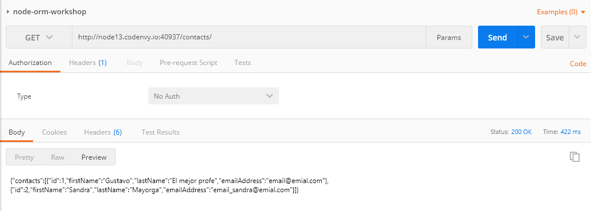

# Taller ORM / NODE-ORM-WORKSHOP 🚀

Pasos a seguir para realizar pruebas básicas con Postman.

## Primer Paso
> Descargar e instalar Postman de el siguiente link : https://www.getpostman.com/downloads/

## Segundo Paso
> Despues de haberlo instalado abriremos la aplicación e iniciaremos sesión, entonces, despues de eso la aplicación nos mostrara la siguiente ventana  y ahí elegiremos la opción de crear un nuevo Request
>
>

## Tercer Paso
> Ahora como podemos ver en la siguiente imagen:
> Resaltado amarillo, escogeremos el metodo que queremos utilizar
> Resaltado azul, pondremos la request URL
> Resaltado rojo, enviaremos la solicitud
>
>

## Metodo GET
> En la siguiente imagen podemos ver que se realizo una petición GET, en la cual podemos ver el estado, tiempo, preview y muchas otras opciones que nos permite ver Postman. Y referente al ejemplo de la petición, podemos ver como obtenemos todos los datos de la tabla contacts.
>
>

## Metodo POST
> Ahora para la petición POST, en este caso insertaremos un contacto y para realizarlo debemos cambiar el selector de peticiones a POST, dirigirnos a Params e insertar los campos correspondiente para el modelo al cual queramos insertar y despues de hacer la solicitud nos mostrara la id con la cual guardo el nuevo contacto.
>
>

## Metodo PUT
> La petición PUT nos permite remplazar o actualizar una representación del elemento, para este ejemplo, como en los anteriores metodos cambiamos el tipo de petición y en este en especifico, en la URL o como parametro, entra la ID del contacto que queremos modificar un element. Nos dirigimos en Body , raw y seleccionamos el tipo que sea JSON. Luego ponemos los campos necesarios y que queremos modificar en el JSON.
>
>
>
>Y si volvemos a llamar la petición GET, podemos observar como cambio.
>
>

## Metodo Delete
>Esta petición es practicamente igual que con el metodo PUT, solo cambiamos el metodo que queremos realizar a DELETE y enviamos la petición.
>
>
>
>Y si volvemos a llamar la petición GET, podemos observar que ya no esta.
>
>

