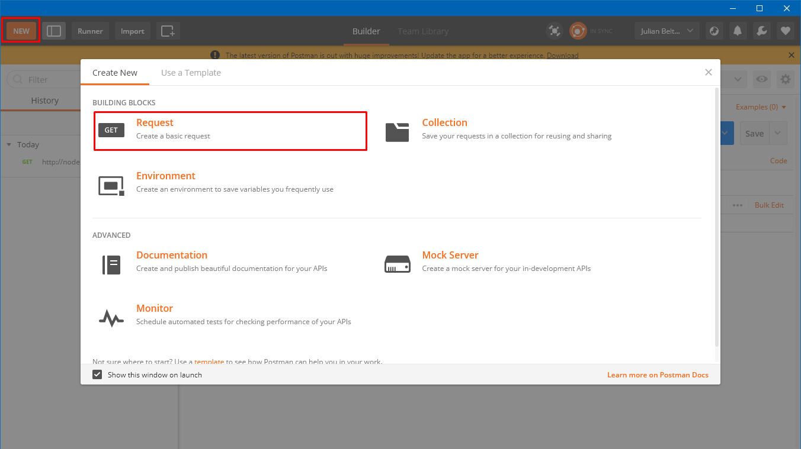

# Taller ORM / NODE-ORM-WORKSHOP

Pasos a seguir para realizar pruebas con Postman del siguiente código.

## Primer Paso
> Descargar e instalar Postman de el siguiente link : https://www.getpostman.com/downloads/

## Segundo Paso
> Despues de haberlo instalado abriremos la aplicación e iniciaremos sesión, entonces, cuando abra la aplicación, crearemos un nuevo Request

## Tercer Paso
> Ahora como podemos ver en la siguiente imagen:
> Resaltado amarillo, escogeremos el metodo que queremos utilizar
> Resaltado azul, pondremos la request URL
> Resaltado rojo, enviaremos la solicitud

# Ahora todo depende de tí ¡El Cielo es el límite!

## :'v
